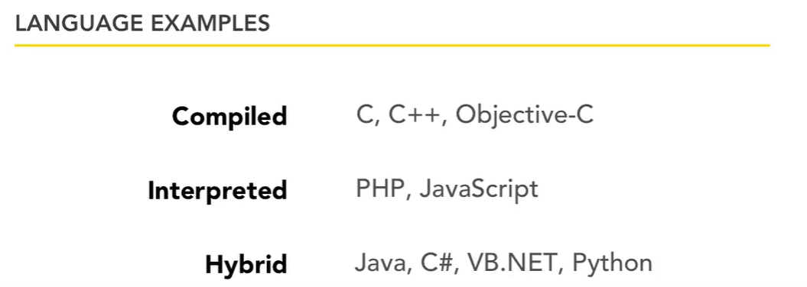

# Interpreted vs Compiled Programming Languages: What's the Difference?

#### In a compiled language, the target machine directly translates the program. In an interpreted language, the source code is not directly translated by the target machine. Instead, a different program, aka the interpreter, reads and executes the code.

### Advantages and disadvantages:

#### Advantages of compiled languages:

Programs that are compiled into native machine code tend to be faster than interpreted code. This is because the process of translating code at run time adds to the overhead, and can cause the program to be slower overall.

#### Disadvantages of compiled languages:

* Additional time needed to complete the entire compilation step before testing
* Platform dependence of the generated binary code

#### Advantages of interpreted languages:

Interpreted languages tend to be more flexible, and often offer features like dynamic typing and smaller program size. Also, because interpreters execute the source program code themselves, the code itself is platform independent.

#### Disadvantages of interpreted languages

The most notable disadvantage is typical execution speed compared to compiled languages.

;

